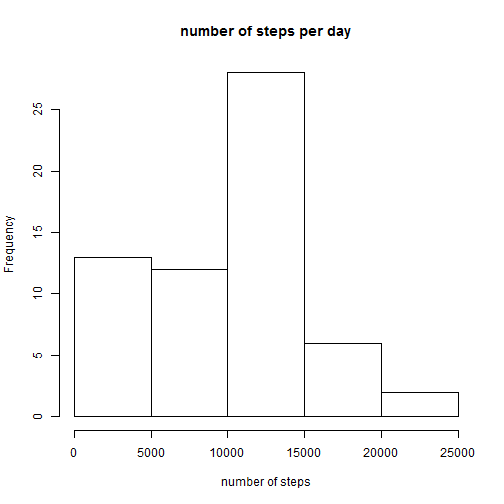
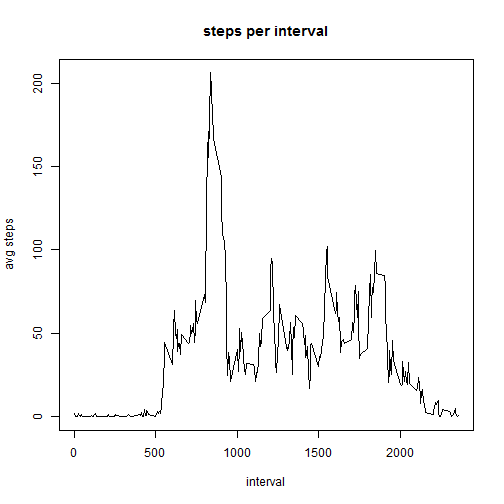
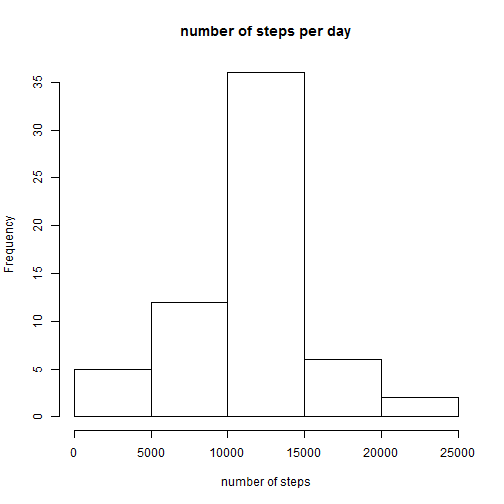
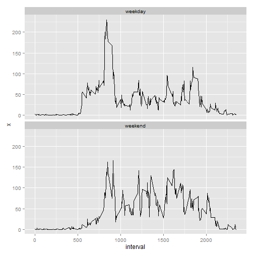

## Loading and preprocessing the data
At first we need to load the data. Since it is zipped, we need to unzip it before.


```r
unzip("activity.zip")
data <- read.csv("activity.csv")
```
After checking how the data looks like, I decided that there is no need to preprocess the data.


```r
head(data)
```

```
##   steps       date interval
## 1    NA 2012-10-01        0
## 2    NA 2012-10-01        5
## 3    NA 2012-10-01       10
## 4    NA 2012-10-01       15
## 5    NA 2012-10-01       20
## 6    NA 2012-10-01       25
```

```r
c(class(data),class(data$steps),class(data$date),class(data$interval))
```

```
## [1] "data.frame" "integer"    "factor"     "integer"
```
## What is mean total number of steps taken per day?  

**Calculate the total number of steps taken per day**

```r
stepsPerDay <- aggregate(data$steps,by=list(date=data$date),sum,na.rm=TRUE)
```

**Make a histogram of the total number of steps taken each day**  

```r
hist(stepsPerDay$x, main="number of steps per day", xlab="number of steps")
```

 

**Calculate and report the mean and median of the total number of steps taken per day** 

* Remark:  
Since sum(c(NA,NA,NA), na.rm=TRUE) delivers 0, and there might be complete days with NA as steps, the mean/median would be influenced by this 0. To avoid this, compute the mean and just take entries, where the mean is not NaN (is.na() checks this as well).

```r
avgStepsPerDay <- aggregate(data$steps,by=list(date=data$date),mean,na.rm=TRUE)
sum(c(NA,NA,NA), na.rm=TRUE)
```

```
## [1] 0
```

```r
mean(c(NA,NA,NA), na.rm=TRUE)
```

```
## [1] NaN
```

```r
stepsPerDay <- stepsPerDay[which(!is.na(avgStepsPerDay$x)),]
```

* Now we can calculate the mean and the median.

```r
mean(stepsPerDay$x)
```

```
## [1] 10766.19
```

```r
median(stepsPerDay$x)
```

```
## [1] 10765
```


## What is the average daily activity pattern?

**Make a time series plot (i.e. type = "l") of the 5-minute interval (x-axis) and the average number of steps taken, averaged across all days (y-axis)**

```r
stepsPerInterval_avg <- aggregate(data$steps,by=list(interval=data$interval),mean,na.rm=TRUE)
plot(x=stepsPerInterval_avg$interval, y=stepsPerInterval_avg$x, type="l", main="steps per interval", xlab="interval",ylab="avg steps")
```

 

**Which 5-minute interval, on average across all the days in the dataset, contains the maximum number of steps?**

```r
stepsPerInterval_avg$interval[which(stepsPerInterval_avg$x==max(stepsPerInterval_avg$x))]
```

```
## [1] 835
```

## Imputing missing values
**Calculate and report the total number of missing values in the dataset (i.e. the total number of rows with NAs)**

```r
length(which(is.na(data$date) | is.na(data$interval) | is.na(data$steps)))
```

```
## [1] 2304
```

**Devise a strategy for filling in all of the missing values in the dataset. The strategy does not need to be sophisticated. For example, you could use the mean/median for that day, or the mean for that 5-minute interval, etc.**

I decided to go for the solution to replace each NA with the mean of the matching interval. This is done by replacing each NA with the matching entry of the above calculated mean of steps per interval.


**Create a new dataset that is equal to the original dataset but with the missing data filled in.**


```r
data_fillNA <- data
data_fillNA$steps[which(is.na(data_fillNA$steps))] <- stepsPerInterval_avg$x[match(data$interval[which(is.na(data$steps))], stepsPerInterval_avg$interval)]
```

**Make a histogram of the total number of steps taken each day and calculate and report the mean and median total number of steps taken per day. Do these values differ from the estimates from the first part of the assignment? What is the impact of imputing missing data on the estimates of the total daily number of steps?**

The procedure is analog to the part "What is mean total number of steps taken per day?". We just have to use the new dataset now.


```r
stepsPerDay <- aggregate(data_fillNA$steps,by=list(date=data_fillNA$date),sum,na.rm=TRUE)
hist(stepsPerDay$x, main="number of steps per day", xlab="number of steps")
```

 

```r
mean(stepsPerDay$x)
```

```
## [1] 10766.19
```

```r
median(stepsPerDay$x)
```

```
## [1] 10766.19
```

The mean stays the same, the median is now equal to the mean. 

## Are there differences in activity patterns between weekdays and weekends?
**Create a new factor variable in the dataset with two levels - "weekday" and   "weekend" indicating whether a given date is a weekday or weekend day.**

```r
Sys.setlocale("LC_ALL", "C")
```

```
## [1] "C"
```

```r
weekday <- weekdays(as.Date(data_fillNA$date))
data_fillNA$weekpoint <- "weekday"
data_fillNA$weekpoint[which(weekday %in% c("Sunday","Saturday"))] <- "weekend"
data_fillNA$weekpoint <- as.factor(data_fillNA$weekpoint)
```

**Make a panel plot containing a time series plot (i.e. type = "l") of the 5-minute interval (x-axis) and the average number of steps taken, averaged across all weekday days or weekend days (y-axis). See the README file in the GitHub repository to see an example of what this plot should look like using simulated data.**

```r
library(ggplot2)
stepsPerInterval_avg <- aggregate(data_fillNA$steps,by=list(interval=data_fillNA$interval, weekpoint=data_fillNA$weekpoint),mean,na.rm=TRUE)
ggplot(stepsPerInterval_avg, aes(x=interval, y=x))+geom_line()+facet_wrap(~weekpoint,nrow=2)
```

 
